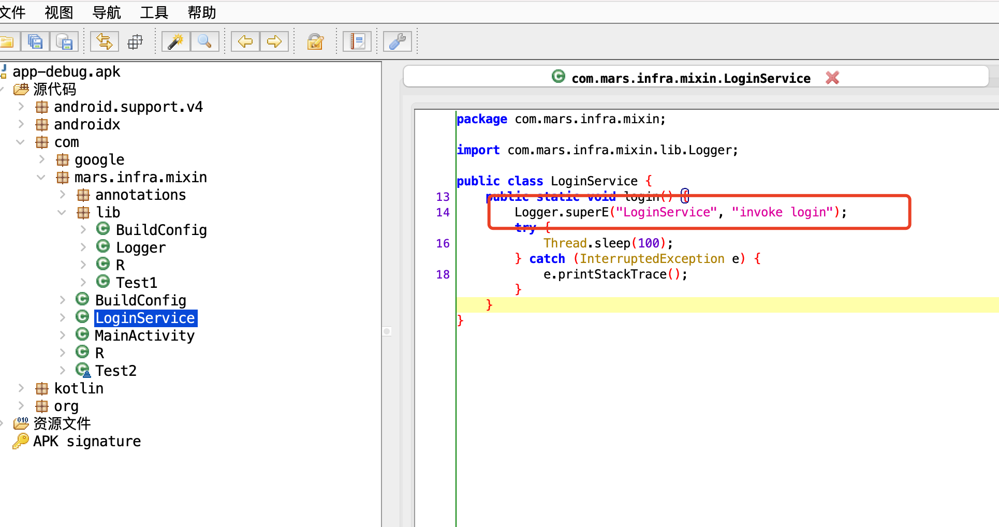

# Mixin

AOP框架，使用注解标识需要aop的方法  

## TODO   
说明：
方法A：表示当前执行的方法，需要被替换     
方法B：用来替换方法A的方法
```java
// 需要将A.a()替换成B.b()方法，正常情况下B这个类是不可以打进apk中的，
// 因此最好的方式是将B中的b()添加到Main中，
// 然后在doAction方法中将A.a()改成直接调用Main.b()
class Main {

    public void doAction() {
        A.a();  
    }
}
```


- [ ] 具体的ClassVisitor或者Transform抽象出来，单独作为一个模块
- [x] 替换指定类中的指定方法
- [ ] 方法B方法不固定，即通过注解标识
- [ ] 先考虑调用方法B
- [ ] 然后再考虑在类A中添加方法B，类A的方法A就直接调用类A中的方法B
- [ ] 方法A已经被hook了，不能在其他地方再次hook方法A，需要做检查
- [ ] 类B是不应该打进apk中的    

[更新日志](https://github.com/JohnnySwordMan/Mixin/blob/develop/UPDATE.md)


### 石器时代       
**任务：** 修改LoginService#login方法中的Log.e方法，替换成Logger.superE
```java
public class LoginService {

    /**
     * aop替换Log.e方法，替换成Logger.superE
     */
    public static void login() {
        Log.e("LoginService", "invoke login");
        try {
            Thread.sleep(100);
        } catch (InterruptedException e) {
            e.printStackTrace();
        }
    }
}
```  
**修改方案：** 这里采用生成一个新的MethodInsnNode对象，将其添加到链表中，并且 删除原先Log.e语句对应的MethodInsnNode。关键代码如下：
```kotlin
private fun modifyMethodInsnNode(it: MethodInsnNode, node: MethodNode) {
    val newMethodInsnNode = MethodInsnNode(
            it.opcode,
            "com/mars/infra/mixin/lib/Logger",
            "superE",
            "(Ljava/lang/String;Ljava/lang/String;)I"
        )
    node.instructions.insert(it, newMethodInsnNode)
    node.instructions.remove(it) 
}
```      
详细代码，参考tag：v1.0   

**注意：**
1. instruction修改前后需要保证操作数栈前后一致。例如：Log.e有返回值，替换的Logger.superE也需要有返回值，否则编译失败，出现了数组越界的问题。

### 青铜时代   
主要任务：利用注解
```kotlin
@Target(AnnotationTarget.FUNCTION)
@Retention(AnnotationRetention.BINARY)
annotation class Proxy(
    val owner: String,  // 想要hook的方法所在的类
    val name: String  // 想要hook的方法
)
```   
例如：
```java
// 想要将app中所有调用Log.e的方法都替换成Logger.superE
public class Logger {

    @Proxy(owner = "android/util/Log", name = "e")
    public static int superE(String tag, String msg) {
        Log.e(tag, msg + " ---> invoke by Logger");
        return -1;
    }
}
```       

方案：
1. 需要收集@Proxy注解，需要知道Logger#superE，以及hook的目标方法Log.e
2. 修改

因此，在transform阶段，第一遍读取整个字节码，收集注解；第二遍读取字节码，进行修改。

一、收集注解，代码如下：   

遍历：
```kotlin
// Transform
override fun transform(transformInvocation: TransformInvocation) {
    Mixin.collectHookInfo(transformInvocation)
}

// Mixin
private fun collectInternal(inputStream: InputStream) {
    inputStream.use {
        val cr = ClassReader(it.readBytes())
        val cv = MixinCollectClassVisitor()
        cr.accept(cv, ClassReader.EXPAND_FRAMES)
    }
}
```
处理字节码：
```kotlin
class MixinCollectAdapter(private val owner: String?,
                          private val methodName: String?,
                          private val methodDesc: String?,
                          methodVisitor: MethodVisitor?): MethodVisitor(Opcodes.ASM7, methodVisitor) {

    override fun visitAnnotation(descriptor: String?, visible: Boolean): AnnotationVisitor? {
        println("MixinCollectAdapter----owner = $owner, method = $methodName, visitAnnotation = $descriptor, visible = $visible")

        var av = super.visitAnnotation(descriptor, visible)
        if (ANNOTATION_PROXY == descriptor) {
            // 记录hookClass
            val mixinData = MixinData(owner, methodName, methodDesc)
//            val proxyData = ProxyData()
//            Mixin.mixinDataList.add(mixinData)
            av = MixinCollectAnnotation(av, mixinData)
        }
        return av
    }
}

class MixinCollectAnnotation(annotationVisitor: AnnotationVisitor?,
                             private val mixinData: MixinData): AnnotationVisitor(Opcodes.ASM7, annotationVisitor) {

    private val proxyData = ProxyData()

    override fun visit(name: String?, value: Any?) {
        super.visit(name, value)
        if (name == "owner") {
            proxyData.owner = value as String?
        } else if (name == "name") {
            proxyData.name = value as String?
        }
        println("MixinCollectAnnotation---visit---name = $name")
    }

    override fun visitEnd() {
        super.visitEnd()
        mixinData.proxyData = proxyData
        Mixin.mixinDataList.add(mixinData)
    }
}
```   

二、修改，代码如下：
```kotlin
private fun MethodInsnNode.handleInsnNode(node: MethodNode) {
    Mixin.mixinDataList.forEach { mixinData ->
        val proxyData = mixinData.proxyData
        if (this.owner == proxyData?.owner
            && this.name == proxyData?.name
            && this.desc == "(Ljava/lang/String;Ljava/lang/String;)I"  // TODO proxtData新增descriptor属性
        ) {
            node.modify(this, mixinData)
        }
    }
}

private fun MethodNode.modify(insnNode: MethodInsnNode, mixinData: MixinData) {
    val newMethodInsnNode =
        MethodInsnNode(
            insnNode.opcode,
            mixinData.owner,
            mixinData.methodName,
            mixinData.descriptor,
            false
        )
    instructions.insert(insnNode, newMethodInsnNode)
    instructions.remove(insnNode)
}
```   

结果如下：
  

TODO   
- [ ] @Proxy注解需要完善，新增scope以及descriptor
- [ ] 不能重复修复同一个方法，新增检测
- [ ] Logger这个类不要打进apk中，需要的只是superE方法，比较好的方式是将该方法添加到调用Log.e方法的类中